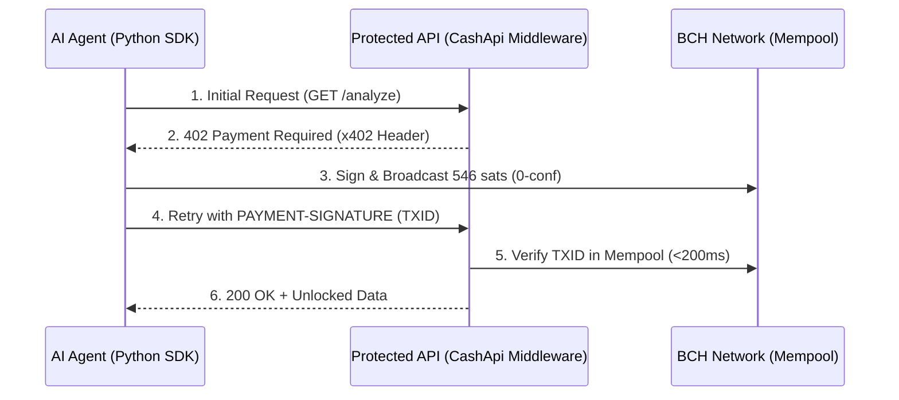

# CashApi: Instant Agent Payments on BCH

**"Zero-Conf, Zero-Friction, Zero-Accounts."**

## The Problem
AI agents today struggle with payments. Credit cards require KYC/accounts, and most crypto networks are too slow or expensive for sub-penny micro-transactions.

## The Solution: CashApi
CashApi is a developer scaffold that implements the **x402 standard** natively for **Bitcoin Cash**. 
By leveraging **BCH 0-conf**, we enable AI agents to pay and unlock data in less than 200ms—faster than a credit card swipe.

## Technical Architecture

## Why BCH?
- **Speed**: 0-conf enables <1s UX. Lightning requires channel management; Solana/Base require finality wait times.
- **Cost**: Fees are less than $0.001 per transaction, enabling real micro-payments.
- **Simplicity**: Stateless JWT-based architecture makes it "plug-and-play."

## Roadmap: Advanced AI Economy
1. **Gemini Integration**: Gating high-reasoning LLM calls with real-time BCH payments.
2. **CashScript Escrow**: Moving from simple payments to multi-party escrows where funds are only cleared if the AI provides a valid "Result Hash."
3. **DSProof Monitoring**: Absolute merchant safety for 0-conf transactions.

## The Discovery Protocol (.well-known/402.json)
CashApi is the first protocol to implement a machine-readable manifest at `/.well-known/402.json`. This allows AI agents to:
- **Pre-flight Check**: Discover all available endpoints and their exact BCH prices before making a request.
- **Budgeting**: Autonomously fund their internal wallets based on the service's published rate card.
- **Stateless Trust**: Secure endpoints are described with clear metadata, enabling a standardized machine-to-machine economy.

***

**CashApi | Built for the BCH-1 Hackcelerator**
